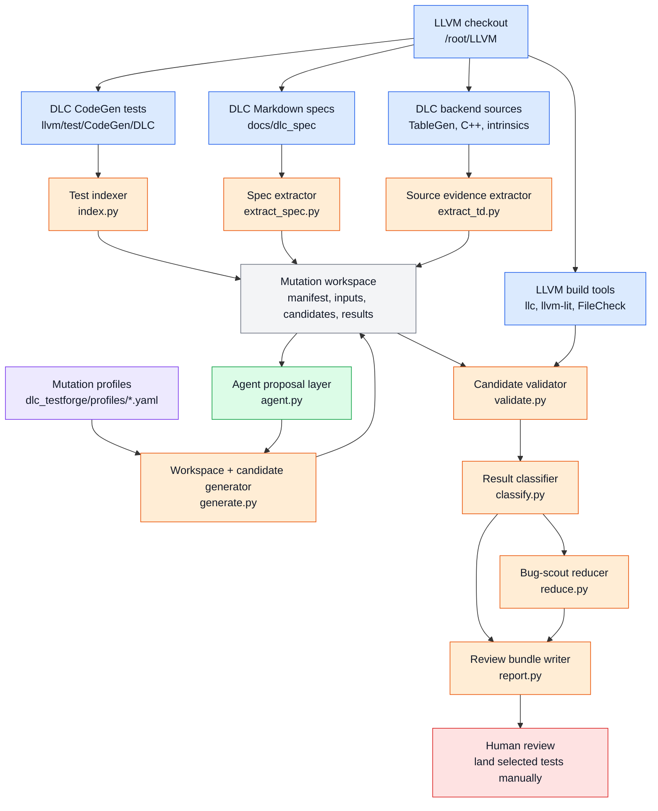

# DLC TestForge

DLC TestForge is a standalone prototype for expanding DLC LLVM CodeGen test
coverage with controlled mutation workflows.

It works around an existing LLVM checkout. It indexes DLC tests, DLC specs, and
DLC backend source evidence, creates isolated mutation workspaces, generates
candidate `.ll` files, validates candidates, classifies results, writes review
bundles, and reduces bug-scout reproducers.

The tool does **not** mutate checked-in LLVM tests directly. Generated files are
written under an output workspace such as `/tmp/dlc-mutation-run`.

## Current Scope

Implemented prototype phases:

- environment discovery for `/root/LLVM` and `/root/LLVM/build`;
- DLC CodeGen test indexing;
- DLC Markdown spec extraction;
- DLC TableGen/source evidence extraction;
- mutation profile loading;
- workspace and manifest generation;
- conservative manual candidate generation;
- candidate validation through LLVM tools;
- validation classification;
- review bundle generation;
- bug-scout reducer;
- agent-assisted mutation proposal mode.

Agent mode is intentionally narrow. The LLM proposes structured mutation ideas.
DLC TestForge validates the proposal, applies only supported mutations, and
records rejected suggestions.

## Quick Start

From the repository root:

```bash
cd /root/DLC_TestForge
python3 -m dlc_testforge.cli --help
```

Check the local LLVM environment:

```bash
python3 -m dlc_testforge.cli env --llvm-root /root/LLVM
python3 -m dlc_testforge.cli check-tools --llvm-root /root/LLVM
```

List available mutation profiles:

```bash
python3 -m dlc_testforge.cli list-profiles --llvm-root /root/LLVM
```

## Manual Mutation Mode

Manual mode generates deterministic mutations from profile-defined axes. It does
not call an LLM.

```bash
python3 -m dlc_testforge.cli generate \
  --llvm-root /root/LLVM \
  --profile machine_addropt \
  --seed llvm/test/CodeGen/DLC/machine-addropt-prera.ll \
  --out-dir /tmp/dlc-mutation-run \
  --max-candidates 10
```

Main artifacts:

- `/tmp/dlc-mutation-run/manifest.json`
- `/tmp/dlc-mutation-run/inputs/test-index.json`
- `/tmp/dlc-mutation-run/inputs/spec-index.json`
- `/tmp/dlc-mutation-run/inputs/td-index.json`
- `/tmp/dlc-mutation-run/candidates/candidate-*.ll`

Use `--dry-run` to create only workspace inputs and indexes:

```bash
python3 -m dlc_testforge.cli generate \
  --llvm-root /root/LLVM \
  --profile machine_addropt \
  --seed llvm/test/CodeGen/DLC/machine-addropt-prera.ll \
  --out-dir /tmp/dlc-mutation-dry-run \
  --dry-run
```

## Agent Mutation Mode

Agent mode asks an LLM for mutation proposals, then routes accepted proposals
through the same candidate-generation path as manual mode.

```bash
python3 -m dlc_testforge.cli generate \
  --llvm-root /root/LLVM \
  --profile machine_addropt \
  --seed llvm/test/CodeGen/DLC/machine-addropt-prera.ll \
  --out-dir /tmp/dlc-agent-run \
  --mode agent \
  --max-candidates 5
```

Credential and endpoint resolution order:

- API key:
  - `DLC_TESTFORGE_LM_API_KEY`
  - `LLVM_HARNESS_LM_API_KEY`
  - `/root/.codex/auth.json` field `OPENAI_API_KEY`
- model:
  - `--agent-model`
  - `DLC_TESTFORGE_LM_MODEL`
  - `LLVM_HARNESS_LM_MODEL`
  - `/root/.codex/config.toml` field `model`
- endpoint:
  - `--agent-endpoint`
  - `DLC_TESTFORGE_LM_API_ENDPOINT`
  - `LLVM_HARNESS_LM_API_ENDPOINT`
  - `/root/.codex/config.toml` provider `base_url`
  - `https://api.openai.com/v1`

Agent artifacts:

- `inputs/agent-context.json`: structured prompt context sent to the model;
- `inputs/agent-proposal.json`: parsed model proposal;
- `results/agent-rejections.json`: rejected suggestions and guardrail reasons;
- `candidates/candidate-*.ll`: accepted proposal outputs.

To test agent mode without making an API call, provide a proposal file:

```bash
python3 -m dlc_testforge.cli generate \
  --llvm-root /root/LLVM \
  --profile machine_addropt \
  --seed llvm/test/CodeGen/DLC/machine-addropt-prera.ll \
  --out-dir /tmp/dlc-agent-file-run \
  --mode agent \
  --agent-proposal /path/to/proposal.json
```

Proposal shape:

```json
{
  "seed": "llvm/test/CodeGen/DLC/machine-addropt-prera.ll",
  "profile": "machine_addropt",
  "proposed_mutations": [
    {
      "axis": "shift_amount_boundary",
      "location_hint": "function shl_add_shra_combine",
      "edits": [
        {
          "old_value": 7,
          "new_value": 8,
          "occurrence": 1
        },
        {
          "old_value": 7,
          "new_value": 8,
          "occurrence": 2
        }
      ],
      "rationale": "exercise adjacent shift boundary"
    }
  ]
}
```

For backward compatibility, a mutation may still use top-level `old_value` and
`new_value`. Prefer `edits` when related immediates must be changed together in
one candidate.

## Validation and Reports

Validate one candidate:

```bash
python3 -m dlc_testforge.cli validate \
  --llvm-root /root/LLVM \
  --candidate /tmp/dlc-mutation-run/candidates/candidate-0001.ll \
  --profile machine_addropt \
  --out-dir /tmp/dlc-validation-candidate-0001
```

Out-of-tree candidates under `/tmp` can pass syntax and `llc` checks while still
needing FileCheck coverage. In that case validation reports `needs-checks`.

To run `llvm-lit` in the normal LLVM test-tree context without permanently
adding the candidate to the repository, use temporary staging:

```bash
python3 -m dlc_testforge.cli validate \
  --llvm-root /root/LLVM \
  --candidate /tmp/dlc-mutation-run/candidates/candidate-0001.ll \
  --profile machine_addropt \
  --out-dir /tmp/dlc-validation-candidate-0001-staged \
  --stage-in-tree
```

`--stage-in-tree` copies the candidate under
`llvm/test/CodeGen/DLC/.dlc-testforge-staging`, runs `llvm-lit`, then removes the
staged file.

Classify the validation result:

```bash
python3 -m dlc_testforge.cli classify \
  --validation /tmp/dlc-validation-candidate-0001/status.json \
  --out /tmp/dlc-mutation-run/results/classifications/candidate-0001.json
```

Important classification states:

- `accepted-regression-candidate`: required validation levels passed;
- `needs-checks`: required checks were missing or skipped;
- `rejected-check-failure`: FileCheck ran and failed;
- `bug-scout-*`: compiler crash, assertion, timeout, or compile failure candidate.

Write review bundles:

```bash
python3 -m dlc_testforge.cli report --run-dir /tmp/dlc-mutation-run
```

Reduce one bug-scout bundle:

```bash
python3 -m dlc_testforge.cli reduce \
  --bundle-dir /tmp/dlc-mutation-run/reports/bug-scout/candidate-0001 \
  --llvm-root /root/LLVM \
  --profile machine_addropt \
  --out-dir /tmp/dlc-reduction-candidate-0001
```

## Architecture



## Safety Model

DLC TestForge keeps generated work reviewable:

- no checked-in LLVM test is modified in place;
- generated candidates are written under a separate workspace;
- agent output must be valid JSON before use;
- unsupported agent axes are rejected and recorded;
- generated tests are not landed automatically;
- bug-scout candidates require human triage before being treated as confirmed bugs.

## Development

Run the test suite:

```bash
python3 -m pytest -q
```

Useful focused commands:

```bash
python3 -m pytest tests/test_agent.py -q
python3 -m pytest tests/test_generate.py -q
git diff --check
```
