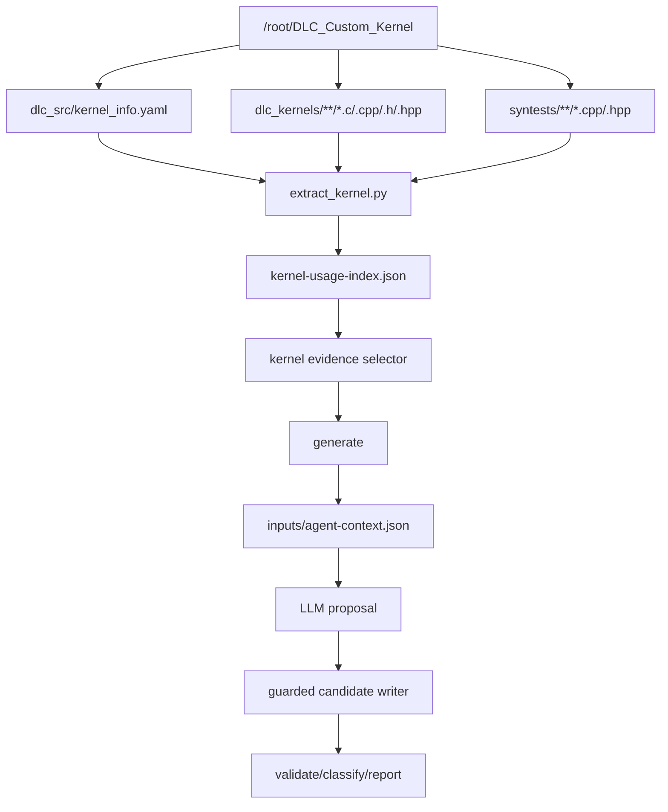

# DLC Custom Kernel Usage Evidence Implementation Plan

## Purpose

DLC TestForge currently knows about three evidence sources:

- existing LLVM DLC CodeGen tests;
- DLC Markdown specs under the LLVM checkout;
- DLC backend TableGen/source records.

That is enough to build a guarded mutation prototype, but it is not enough to
make high-quality edge-case suggestions that reflect how DLC kernels are written
by kernel engineers. The next implementation step is to extract structured usage
evidence from `/root/DLC_Custom_Kernel` and use it as an optional fourth evidence
source during mutation generation.

The goal is not to compile or validate custom kernels inside TestForge. The goal
is to mine stable usage patterns from production-style kernel code, normalize
them, and feed the relevant subset into deterministic mutators and the agent
proposal context.

## Success Criteria

This phase is complete when:

- TestForge can create a normalized JSON index from `/root/DLC_Custom_Kernel`.
- The index contains kernel inventory records, source usage records, constants,
  relation hints, and generated edge hints.
- The extractor is covered by focused tests using small synthetic fixtures.
- `generate --mode agent` can optionally include selected kernel evidence in
  `inputs/agent-context.json`.
- Existing manual and agent generation behavior remains unchanged when no kernel
  usage index is provided.
- The LLM still proposes only structured ideas; TestForge remains responsible
  for applying, validating, and classifying candidates.

## Non-Goals

- Do not run the DLC custom kernel build from TestForge.
- Do not parse full C/C++ ASTs in the first implementation.
- Do not pass raw large kernel source files to the LLM.
- Do not make generated `.ll` candidates correct by trusting kernel evidence
  alone.
- Do not add broad semantic mutators before the extracted evidence proves useful.

## High-Level Architecture



## Proposed CLI

Add a new command:

```bash
python3 -m dlc_testforge.cli extract-kernel \
  --kernel-root /root/DLC_Custom_Kernel \
  --out /tmp/dlc-kernel-usage-index.json
```

Add optional generation input:

```bash
python3 -m dlc_testforge.cli generate \
  --llvm-root /root/LLVM \
  --profile machine_addropt \
  --seed llvm/test/CodeGen/DLC/machine-addropt-prera.ll \
  --out-dir /tmp/dlc-agent-run \
  --mode agent \
  --kernel-usage-index /tmp/dlc-kernel-usage-index.json
```

Generation must still work without `--kernel-usage-index`.

## Output Schema

Create schema version 1. Keep it JSON-only and deterministic so it is easy to
diff in tests and logs.

```json
{
  "schema_version": 1,
  "root": "/root/DLC_Custom_Kernel",
  "summary": {
    "kernel_count": 0,
    "source_file_count": 0,
    "syntest_file_count": 0,
    "dma_call_count": 0,
    "sync_call_count": 0,
    "vector_usage_count": 0,
    "edge_hint_count": 0
  },
  "kernels": [
    {
      "name": "custom_FusedRMSNorm_f32",
      "source": "dlc_kernels/FusedRMSNorm.c",
      "category": "root",
      "dtype_hints": ["f32"],
      "features": ["dma", "hbm", "vmem", "vector", "mask"],
      "usage": {
        "dma_calls": [],
        "sync_calls": [],
        "memory_spaces": ["HBM", "VMEM"],
        "vector_types": ["float8_128"],
        "intrinsics": ["v_f32_ld_tnsr_st_msk"],
        "constants": [7, 32, 128, 256, 1024],
        "relations": []
      },
      "edge_hints": []
    }
  ],
  "global_edge_hints": []
}
```

### Kernel Record Fields

- `name`: kernel name from YAML or derived from source filename.
- `source`: repo-relative path to the primary source file, if found.
- `category`: first directory under `dlc_kernels`, or `root` for top-level files.
- `dtype_hints`: values inferred from names and source tokens, such as `f32`,
  `bf16`, `i32`, `i64`, `int8`.
- `features`: normalized tags used for evidence selection.
- `usage`: extracted call sites and token evidence.
- `edge_hints`: mutation-relevant boundaries derived from local usage.

## Implementation Steps

### Step 1: Add Data Models

Create `dlc_testforge/extract_kernel.py`.

Define small dataclasses with `to_dict()` methods:

- `KernelUsageIndex`
- `KernelUsageSummary`
- `KernelRecord`
- `DmaCall`
- `SyncCall`
- `RelationHint`
- `EdgeHint`

Keep the schema flat. Avoid deeply nested class trees until the index proves
stable.

Verification:

```bash
python3 -m pytest tests/test_extract_kernel.py -q
```

### Step 2: Parse Kernel Inventory

Inputs:

- `dlc_src/kernel_info.yaml`
- discovered files under `dlc_kernels`

Rules:

- Load YAML with `yaml.safe_load`.
- Treat missing YAML as a recoverable error only when source discovery can still
  build an inventory.
- For each YAML entry, use `name` as the public kernel name.
- Resolve source by `src` when present:
  - try `dlc_kernels/<src>.c`;
  - try `dlc_kernels/<src>.cpp`;
  - try `dlc_kernels/<src>.h`;
  - try recursive basename match if the direct path fails.
- For source files not referenced by YAML, add derived records using the file
  stem.
- Sort records by `name` and `source` for deterministic output.

Edge cases:

- YAML names may use mixed `custom_` and `Custom_` prefixes.
- Some sources live in subdirectories.
- Header-only helper files should be indexed as evidence files but should not be
  overcounted as production kernels unless referenced or named like kernels.

Verification:

- Fixture with YAML `src`.
- Fixture with implicit `custom_<name>.c`.
- Fixture with source in a subdirectory.

### Step 3: Extract Source Usage

Use regex and balanced-argument scanning, not full C parsing.

Extract:

- `dlc_dma(...)`
- `dlc_sync(...)`
- memory spaces: `HBM`, `VMEM`, `CMEM`, `SMEM`
- vector types: `float8_128`, `int8_128`, `bf16_128`, and similar
- vector/intrinsic tokens: names beginning with `v_`, `__dlc_`, `gstf`, `gsnf`,
  masked load/store tokens containing `msk`, `mask`, `ld`, or `st`
- integer constants that appear in meaningful code lines

For `dlc_dma`, capture the argument strings into:

```json
{
  "line": 42,
  "src_addr": "input->address + offset",
  "src_space": "HBM",
  "dst_addr": "vmem_addr",
  "dst_space": "VMEM",
  "length": "tile_len",
  "src_stride": "0",
  "dst_stride": "0",
  "unit_len": "tile_len",
  "addr_exp": "7"
}
```

Implementation detail:

- Find `dlc_dma(` token positions.
- Scan forward while tracking parentheses depth.
- Split arguments only on commas at depth zero.
- Store the original argument text trimmed; do not evaluate expressions yet.

Verification:

- Multiline `dlc_dma`.
- Nested expression arguments.
- Multiple DMA calls in one file.
- `dlc_sync(handle)` extraction.

### Step 4: Generate Relation Hints

Relation hints are explainable facts mined from common source patterns. They are
not proof of compiler behavior; they are prompts and mutator hints.

Initial relation kinds:

- `address_exponent`: `addr_exp` argument equals `7` or nearby integer.
- `dma_length_boundary`: DMA `length` or `unit_len` references `128`, `256`,
  `512`, or `1024`.
- `stride_boundary`: DMA stride arguments reference `128`, `256`, or variables
  whose names contain `stride`.
- `tile_boundary`: source contains tile constants such as `1024`, `2048`,
  `3072`, or `4096`.
- `mask_boundary`: source contains `pre_exp2`, `mask`, `msk`, masked load/store
  intrinsics, or tail length expressions.
- `dual_xys_split`: source contains `get_device_id`, XYS-specific branches, or
  even/odd split patterns.
- `memory_space_pair`: DMA source/destination spaces form pairs such as
  `HBM->VMEM`, `VMEM->HBM`, `CMEM->VMEM`, or `SMEM->VMEM`.

Each relation should include:

- `kind`
- `line`
- `evidence`
- `reason`

Verification:

- Small fixture per relation family.
- No relation generated from comments alone.

### Step 5: Generate Edge Hints

Convert usage and relation hints into concrete edge values.

Initial edge hint kinds:

- `address_unit_boundary`: values around `128`.
- `dma_length_boundary`: values around `128`, `256`, `512`, `1024`.
- `addr_exp_boundary`: values around `7`.
- `vector_lane_boundary`: values around `8`, `32`, `128`, `1024`.
- `tile_boundary`: values around observed tile sizes.
- `mask_boundary`: values around lane counts and tail counts.
- `stride_boundary`: values around observed stride constants.

For each base value `N`, emit `[N - 1, N, N + 1]` when `N > 1`.

Example:

```json
{
  "kind": "addr_exp_boundary",
  "base": 7,
  "values": [6, 7, 8],
  "source": "dlc_kernels/foo.c:18",
  "reason": "dlc_dma addr_exp commonly uses 7 for x128 address scaling"
}
```

Deduplicate edge hints by `(kind, base, source)`.

Verification:

- Constants produce stable edge hints.
- Duplicated constants do not explode the hint count.
- Negative values are not emitted for low bases.

### Step 6: Add CLI Command

Update `dlc_testforge/cli.py`:

- import `build_kernel_usage_index`, `write_kernel_usage_index`;
- add `cmd_extract_kernel`;
- add `extract-kernel` subcommand with:
  - `--kernel-root`
  - `--out`

Error handling should match existing extract commands:

- `OSError` -> exit `2`
- `ValueError` -> exit `2`

Verification:

```bash
python3 -m dlc_testforge.cli extract-kernel \
  --kernel-root /tmp/testforge-kernel-fixture \
  --out /tmp/kernel-usage-index.json
```

### Step 7: Select Relevant Kernel Evidence

Add a selector function, likely in `agent.py` or a small new module:

```python
select_kernel_evidence(
  kernel_index: dict[str, Any],
  profile_name: str,
  seed_relative: str,
  max_records: int = 12,
) -> dict[str, Any]
```

Selection should be conservative:

- For `machine_addropt`, prefer records with DMA, address unit, stride, memory
  space, `addr_exp`, and tile hints.
- For `globalisel`, prefer records with vector types, intrinsics, dtype hints,
  masks, and mixed integer/float usage.
- Use seed path and profile name as weak signals only.
- Include `summary`, selected `kernels`, and `global_edge_hints`.
- Cap record count and text size to keep the LLM context small.

Do not include full source text.

Verification:

- Selector returns deterministic top records.
- Selector respects `max_records`.
- Missing or malformed index yields an empty evidence block, not a crash during
  normal generation.

### Step 8: Integrate With Workspace Generation

Update `create_workspace()`:

- add optional `kernel_usage_index: Path | None = None`;
- when provided, load the JSON and copy it to
  `inputs/kernel-usage-index.json`;
- include selected kernel evidence in `build_agent_context()`;
- record the copied path in `manifest.inputs`.

Update `build_agent_context()`:

- add optional `kernel_usage_evidence`;
- include it under a new `kernel_usage_evidence` top-level key;
- update guardrails to explain that kernel evidence is usage evidence, not a
  permission to invent unsupported mutations.

Update CLI:

- add `--kernel-usage-index` to `generate`.

Verification:

- Existing `generate` tests pass unchanged.
- New test confirms `agent-context.json` contains `kernel_usage_evidence` only
  when the option is provided.
- New test confirms manifest input paths are correct.

### Step 9: Teach Agent Proposals About Evidence Tags

Extend the agent proposal schema minimally:

Current required fields stay the same:

- `axis`
- `location_hint`
- `edits`
- `rationale`

Add optional fields:

- `evidence_tags`: list of strings, such as `dma_length_boundary` or
  `addr_exp_boundary`.
- `source_evidence`: short string explaining which evidence influenced the idea.

These fields are metadata only in the first implementation. They must not be
required to apply a candidate.

Verification:

- Existing proposal JSON still parses.
- Proposal with optional metadata parses and records metadata in
  `agent-proposal.json`.
- Unsupported metadata does not affect candidate application.

### Step 10: Add Kernel-Informed Mutator Support

Implemented deterministic support connects selected kernel `edge_hints` to
candidate generation when `--kernel-usage-index` is provided.

Implemented named axis support:

- `addr_exp_boundary`
- `dma_length_boundary`
- `stride_boundary`
- `tile_boundary`
- `vector_lane_boundary`
- `mask_boundary`

Current behavior:

- Manual generation prioritizes kernel-informed candidates before generic
  immediate candidates when a kernel usage index is available.
- The mutator maps each axis to conservative `.ll` line matching rules:
  - address-like axes match shifts, arithmetic, pointer casts, and GEP-like
    lines;
  - vector and mask axes match vector types, mask-like names, selects, compares,
    and bitwise mask operations.
- Only integer immediate replacements are applied.
- New values must still be listed in `profile.mutation_axes.immediates.values`.
- Candidate manifest entries record `evidence_tags` and `source_evidence`.
- Agent proposals may use the same kernel-informed axis names, but they remain
  subject to the same value and line-application guardrails.

Verification:

- Existing no-kernel manual generation remains unchanged.
- Kernel-informed generation records evidence metadata in the manifest.
- Malformed, unsupported, duplicate, or profile-disallowed hints are skipped.
- Agent proposals using kernel-informed axis names can be accepted and applied.
- Generated candidates remain isolated under workspace `candidates/`.

## Test Plan

Add:

- `tests/test_extract_kernel.py`
- fixture-building helpers inside the test file using `tmp_path`
- CLI test for `extract-kernel`
- generate test for optional `--kernel-usage-index`
- agent parsing test for optional metadata fields, if Step 9 is implemented

Run:

```bash
cd /root/DLC_TestForge
python3 -m pytest -q
git diff --check
```

Manual smoke:

```bash
python3 -m dlc_testforge.cli extract-kernel \
  --kernel-root /root/DLC_Custom_Kernel \
  --out /tmp/dlc-kernel-usage-index.json

python3 -m dlc_testforge.cli generate \
  --llvm-root /root/LLVM \
  --profile machine_addropt \
  --seed llvm/test/CodeGen/DLC/machine-addropt-prera.ll \
  --out-dir /tmp/dlc-agent-kernel-evidence-smoke \
  --mode agent \
  --kernel-usage-index /tmp/dlc-kernel-usage-index.json \
  --max-candidates 2
```

Inspect:

- `/tmp/dlc-kernel-usage-index.json`
- `/tmp/dlc-agent-kernel-evidence-smoke/inputs/agent-context.json`
- `/tmp/dlc-agent-kernel-evidence-smoke/results/agent-rejections.json`
- `/tmp/dlc-agent-kernel-evidence-smoke/candidates/candidate-*.ll`

## Quality Gates

Before merging:

- The extractor must not require `/root/DLC_Custom_Kernel` in unit tests.
- Real-repo extraction should complete without crashing on unusual files.
- The generated index should be deterministic across repeated runs.
- Agent mode without `--kernel-usage-index` must produce the same context shape
  as before, except for intentionally versioned additions.
- No candidate should be accepted merely because an LLM cites kernel evidence.
  Validation and classification remain mandatory.

## Risks and Mitigations

Risk: Regex extraction misses valid C/C++ patterns.

Mitigation: Store raw call argument text and line numbers. Prefer partial but
trustworthy evidence over complicated parsing.

Risk: Kernel evidence biases the LLM toward source-level behavior that does not
map cleanly to LLVM IR.

Mitigation: The context must call it usage evidence. Candidate application stays
restricted to supported `.ll` mutations.

Risk: The index becomes too large for prompt context.

Mitigation: Always select and cap relevant records. Never pass raw full source
files to the LLM.

Risk: Edge hints create noisy low-value candidates.

Mitigation: Keep hint metadata in the manifest and classifier output so noisy
families can be disabled by profile later.

## Recommended Implementation Order

1. Implement `extract_kernel.py` data models and inventory discovery.
2. Add source usage extraction for DMA, sync, memory spaces, vector tokens, and
   constants.
3. Add relation and edge hint generation.
4. Add `extract-kernel` CLI and tests.
5. Add optional `--kernel-usage-index` plumbing into `generate`.
6. Add kernel evidence selection into agent context.
7. Add optional proposal metadata fields.
8. Only then add new deterministic kernel-informed mutation axes.

This order keeps the first merge inspectable: evidence extraction can be judged
before it changes candidate generation behavior.
