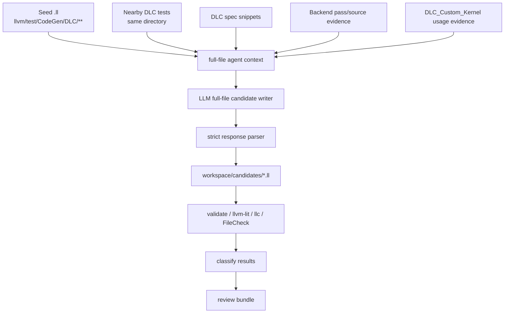

# Seed `.ll` Full-File Agent Mutation Proposal

## Purpose

DLC compiler engineers usually add or update tests under
`LLVM/llvm/test/CodeGen/DLC/` when they fix pass edge cases, refactor a pass,
optimize code generation, or add new backend functionality. The normal workflow
is to add one focused `.ll` file, or update an existing `.ll` file, and run
`llvm-lit` against the DLC CodeGen test tree.

DLC TestForge should support that workflow directly:

- input: one seed `.ll` test file from `llvm/test/CodeGen/DLC/**`;
- output: multiple complete mutation `.ll` candidate files;
- validation: run the existing TestForge validation/classification pipeline;
- review: engineers inspect useful candidates and manually add selected tests
  to the LLVM test tree.

The current prototype can mutate integer immediates and can use DLC custom
kernel edge hints to prioritize some boundary values. That remains useful as a
guarded baseline, but it is not enough for real edge-case prevention. DLC
TestForge now also has an `agent-full-file` mode that lets the LLM understand
the seed test, DLC-specific evidence, and production-style kernel usage, then
write complete candidate `.ll` files instead of only proposing small immediate
edits.

## Current State

Implemented pieces that should be reused:

- workspace creation, manifest writing, and isolated candidate output;
- test/spec/TableGen/source indexing;
- DLC custom kernel usage extraction and evidence selection;
- LLM API connection, structured agent proposal parsing, and full-file proposal
  parsing;
- full-file agent context construction and request handling;
- full-file candidate quality gates, workspace integration, and CLI exposure;
- candidate validation, classification, report writing, and reduction;
- temporary in-tree validation with `--stage-in-tree`.

Current limitation:

- deterministic kernel-informed mutation still changes integer immediates only;
- full-file candidates still require validation and human review before being
  treated as useful regression tests.

## Capability

The agent full-file generation mode produces complete `.ll` candidate files from a
single seed `.ll`.

CLI shape:

```bash
python3 -m dlc_testforge.cli generate \
  --llvm-root /root/LLVM \
  --profile machine_addropt \
  --seed llvm/test/CodeGen/DLC/machine-addropt-prera.ll \
  --out-dir /tmp/dlc-full-file-agent-run \
  --mode agent-full-file \
  --kernel-usage-index /tmp/dlc-kernel-usage-index.json \
  --max-candidates 5
```

The new mode should not replace the existing modes:

- `manual`: deterministic baseline mutation;
- `agent`: guarded structured edit proposals;
- `agent-full-file`: LLM writes complete `.ll` candidates, TestForge validates.

## High-Level Architecture



## Agent Context

The context sent to the LLM should be generated deterministically and saved as
`inputs/full-file-agent-context.json`.

Include:

- seed path and complete seed `.ll` text;
- parsed RUN lines and CHECK prefixes;
- seed directory and a capped list of nearby `.ll` tests from the same
  directory;
- active profile summary and validation commands;
- selected DLC spec records;
- selected backend source/TableGen records;
- selected DLC custom kernel usage evidence, when provided;
- explicit constraints and output schema.

Context constraints should say:

- preserve the seed test's intended pass/workflow unless the candidate
  rationale explains a deliberate narrow variation;
- keep RUN lines valid for the active profile;
- do not invent DLC intrinsics, instructions, address spaces, or datalayouts;
- generate complete `.ll` files, not patches or prose;
- each candidate must be meaningfully different from the seed;
- each candidate should target one clear stress point;
- FileCheck updates are allowed, but candidates that cannot be checked will be
  classified as `needs-checks`;
- validation/classification is the authority, not the LLM rationale.

## LLM Output Schema

The model should return one JSON object:

```json
{
  "seed": "llvm/test/CodeGen/DLC/machine-addropt-prera.ll",
  "profile": "machine_addropt",
  "candidates": [
    {
      "filename": "machine-addropt-prera-mut-addr-exp-reuse.ll",
      "text": "; RUN: ...\n\ndefine ...\n",
      "rationale": "Stress address exponent reuse across two scaled bases.",
      "intended_stress": "machine address combine with reused scaled operands",
      "evidence_tags": ["addr_exp_boundary", "memory_space_pair"],
      "source_evidence": "DLC_Custom_Kernel address exponent hints around 7"
    }
  ]
}
```

Parsing rules:

- `seed` and `profile` must match the requested seed/profile exactly;
- `candidates` must be a non-empty list unless the model explicitly cannot
  produce a valid candidate;
- `filename` must be a basename ending in `.ll`;
- `text` must be a complete `.ll` file;
- `rationale` and `intended_stress` must be non-empty strings;
- `evidence_tags` and `source_evidence` are optional metadata;
- reject paths with `/`, `..`, absolute paths, or non-`.ll` extensions;
- cap candidates at `--max-candidates`.

## LLM Driver Reference

The LLM connection does not need to be designed from scratch. The existing
`/root/dlc-llvm-harness` project already uses an OpenRouter-based driver that
can be used as the implementation reference for this feature.

Relevant reference points:

- `/root/dlc-llvm-harness/autofix/dlc_middle_end.py`
  - `build_agent_config()` selects `OpenRouterAgentsAgent` when
    `--driver openrouter` is used.
- `/root/dlc-llvm-harness/autofix/mini.py`
  - uses the same `--driver` / `--model` pattern with OpenRouter support.
- `/root/dlc-llvm-harness/harness/lms/openrouter_agents.py`
  - implements `OpenRouterAgentsAgent` with the Agents SDK and an
    OpenAI-compatible OpenRouter provider.
- `/root/dlc-llvm-harness/harness/lms/codex_config.py`
  - resolves API key and endpoint from `LLVM_HARNESS_LM_API_KEY`,
    `LLVM_HARNESS_LM_API_ENDPOINT`, `/root/.codex/auth.json`, and
    `/root/.codex/config.toml`.
  - migrates plain OpenAI model names such as `gpt-*` to `openai/<model>` when
    needed for OpenRouter.

DLC TestForge already has lightweight direct HTTP LLM connection code for the
current structured proposal mode. For `agent-full-file`, the implementation can
either keep that direct HTTP style or factor a small internal driver layer, but
it should preserve compatibility with the harness environment variables and
Codex config files listed above.

## Candidate Writing

Write accepted model outputs under the existing workspace:

```text
workspace/
  inputs/
    seed.ll
    full-file-agent-context.json
    full-file-agent-proposal.json
  candidates/
    candidate-0001.ll
    candidate-0002.ll
  results/
    full-file-agent-rejections.json
```

Candidate filenames in the model response are suggestions only. TestForge should
continue using canonical `candidate-000N.ll` output names to avoid collisions,
while storing the suggested filename in manifest metadata.

Each manifest candidate record should include:

- path;
- seed;
- profile;
- mutation axis or generation mode, e.g. `agent_full_file`;
- suggested filename;
- rationale;
- intended stress point;
- evidence tags;
- source evidence.

## Quality Gates

Before validation, reject candidates that clearly violate the contract:

- empty file;
- missing RUN line;
- contains Markdown fences or explanatory prose outside LLVM comments;
- filename/path escape attempt;
- exact duplicate of the seed text;
- exact duplicate of another generated candidate;
- file size much larger than the seed without a clear limit.

After writing candidates, rely on existing validation:

- syntax-level checks;
- profile command checks;
- FileCheck/llvm-lit where available;
- staged in-tree validation when requested;
- classification into accepted, needs-checks, rejected, or bug-scout states.

## Implemented Components

### Phase A: Data Model and Parser

- `AgentFullFileCandidate` and `AgentFullFileProposal` data models are present.
- `parse_agent_full_file_proposal()` performs strict validation.
- Unit tests cover valid proposals, malformed JSON, mismatched seed/profile,
  unsafe filenames, missing text, duplicate candidates, and optional metadata.

### Phase B: Context Builder

- `build_full_file_agent_context()` builds deterministic prompt context.
- Existing test/spec/source/kernel selectors are reused.
- Nearby-test selection reads a capped set from the seed directory.
- Context is saved under `inputs/full-file-agent-context.json`.
- Unit tests confirm context includes seed text, RUN lines, profile data, and
  selected kernel evidence only when provided.

### Phase C: LLM Request Path

- `request_agent_full_file_proposal()` uses the existing TestForge API
  resolution rules, while preserving compatibility with the OpenRouter
  environment/config conventions used by `/root/dlc-llvm-harness`.
- `/root/dlc-llvm-harness/harness/lms/openrouter_agents.py` and
  `/root/dlc-llvm-harness/harness/lms/codex_config.py` as references for
  OpenRouter model migration, API key resolution, endpoint resolution, and
  failure messages.
- Requests use temperature `0`.
- The prompt includes the full-file output schema and guardrails.
- Tests mock `urllib.request.urlopen`.

### Phase D: Workspace Integration

- `generate --mode` accepts `agent-full-file`.
- `--agent-full-file-proposal` supports offline testing without an API
  call.
- Parsed proposals are written to `inputs/full-file-agent-proposal.json`.
- Valid candidates are written to `candidates/candidate-000N.ll`.
- Rejected model outputs are written to `results/full-file-agent-rejections.json`.
- `manual` and existing `agent` behavior remain unchanged.

### Phase E: Validation Workflow

- Reuse existing `validate`, `classify`, and `report` commands.
- Document the recommended loop:
  - generate candidates;
  - validate each candidate;
  - classify results;
  - stage in tree only for serious candidates;
  - manually add selected `.ll` files to LLVM.

## Example

Seed fragment:

```llvm
; RUN: llc -mtriple=dlc -stop-after=dlc-machine-addropt %s -o - | FileCheck %s

define i32 @single_scaled_base(i32 %x) {
  %scaled = shl i32 %x, 7
  %biased = add i32 %scaled, 128
  ret i32 %biased
}
```

Potential full-file candidate:

```llvm
; RUN: llc -mtriple=dlc -stop-after=dlc-machine-addropt %s -o - | FileCheck %s

define i32 @two_scaled_bases_shared_exp(i32 %x, i32 %y) {
  %scaled.x = shl i32 %x, 7
  %scaled.y = shl i32 %y, 7
  %sum = add i32 %scaled.x, %scaled.y
  %biased = add i32 %sum, 128
  ret i32 %biased
}
```

This is still derived from the seed, but it is not just an immediate mutation.
It creates a related address expression shape that can stress machine address
optimization in a way closer to real pass edge-case prevention.

## Non-Goals

- Do not automatically commit generated candidates into LLVM.
- Do not trust LLM-written tests without validation.
- Do not require `DLC_Custom_Kernel` for all runs.
- Do not replace deterministic mutators; keep them as cheap baselines and
  fallbacks.
- Do not implement broad LLVM IR semantic rewriting in this phase.

## Success Criteria

This feature is ready when:

- one seed `.ll` can produce multiple complete `.ll` candidate files;
- candidates preserve valid RUN lines or are rejected before validation;
- model outputs are saved and auditable;
- validation/classification can run on every generated candidate;
- existing `manual` and `agent` tests still pass unchanged;
- documentation explains that generated files are candidates for review, not
  automatically accepted regression tests.
